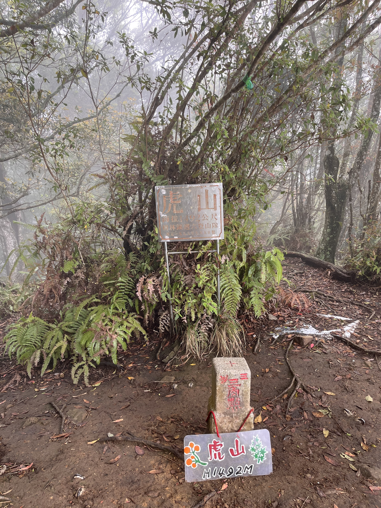
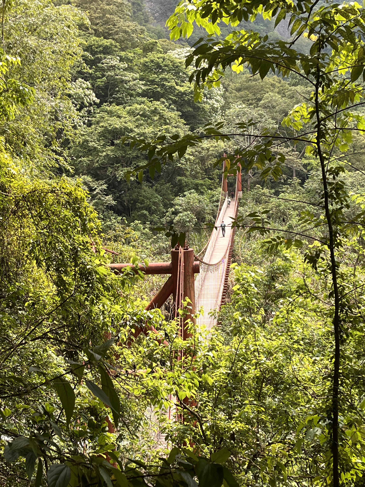

+++
date = '2026-05-01T15:43:28+08:00'
draft = true
title = '虎山'
+++

## 路線

泰安溫泉停車場→（1K,15分鐘）→水雲吊橋→（0.2K,5分鐘）→水雲瀑布叉路→（2.1K,80分鐘）→溪谷叉路→（1K,80分鐘）→加里山叉路→（0.2K,5分鐘）→虎山→（3.3K,100分鐘）→水雲瀑布叉路→（1.2K,15分鐘）→泰安溫泉停車場

## 筆記

- 水雲吊橋是這條路線的亮點之一，走在吊橋上可以欣賞到溪谷的美景，非常推薦。
- 這條路線總共有 1 ~ 8 個路牌，1 是樓梯，2 ~ 7 相對是緩坡，第 8 個路牌後是最難的部分爬升 400 左右非常累，下山時也要特別小心。
- 虎山的視野非常好，可以看到整個泰安地區的風景，尤其是在天氣好的時候，不過當天起了大霧，什麼都看不到。
- 這次總共花了 6 個小時左右完成這條路線，比健行筆記預估的 5 個小時多了 1 小時。

## 三角點

## 水雲吊橋

